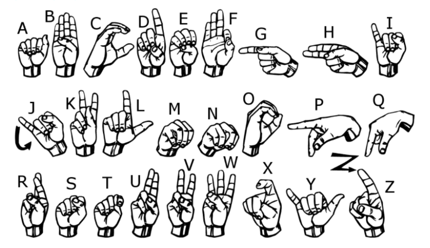

# ☝️ Sign Language Recognition with Deep Learning  
### CNN-Based American Sign Language (ASL) Alphabet Classification

This repository presents a **deep learning–based sign language recognition system** designed to classify **American Sign Language (ASL) alphabet gestures** from image data. The project demonstrates how **convolutional neural networks (CNNs)** and classical machine learning techniques can be applied to **vision-based human–computer interaction problems**, with a strong focus on accessibility and real-world usability.

The complete implementation—including data preprocessing, model design, training, evaluation, and inference—is provided in a **reproducible Jupyter Notebook**, accompanied by qualitative visual outputs.

---

## 📌 Project Overview

Sign language recognition is a critical application of computer vision and artificial intelligence, aiming to **bridge the communication gap** between hearing-impaired individuals and the wider society.

In this project:
- **26 American Sign Language (ASL) alphabet classes** are recognized  
- Image-based hand gesture data is processed and classified  
- Deep learning techniques are used to achieve reliable recognition performance  

The system is designed as a **foundational recognition pipeline**, suitable for extension to real-time applications such as webcams, mobile devices, or assistive communication systems.

---

## 🎯 Objective

The main objectives of this study are:

- To design a **vision-based sign language recognition model**
- To apply **CNN architectures** for robust feature extraction
- To train and evaluate the model on a standardized ASL dataset
- To demonstrate inference results visually and quantitatively
- To provide a clean, well-documented notebook-based implementation

---

## 📂 Dataset Description

The project uses the widely known **ASL Sign Language MNIST dataset**, consisting of grayscale hand gesture images stored in CSV format:

- **Training dataset:** `sign_mnist_train`
- **Test dataset:** `sign_mnist_test`
- **Classes:** 26 (A–Z, excluding dynamic gestures)
- **Image resolution:** 28×28 pixels (grayscale)

Each sample represents a single hand gesture corresponding to a specific ASL letter.

---

## 🧠 Methodology & Pipeline

The implemented pipeline follows these stages:

1. **Data Loading**
   - Reading CSV-based image data
   - Separating labels and pixel values

2. **Preprocessing**
   - Normalization of pixel intensities
   - Reshaping flat vectors into image tensors
   - Label encoding and preparation

3. **Model Design**
   - Convolutional Neural Network (CNN) architecture
   - Convolution + pooling layers for feature extraction
   - Fully connected layers for classification

4. **Training**
   - Model compilation and optimization
   - Training on labeled ASL images
   - Monitoring loss and accuracy

5. **Evaluation & Inference**
   - Performance evaluation on test data
   - Prediction on sample images
   - Visualization of classification outputs

---

## 🧩 Implementation Details

All implementation steps are contained in the notebook:

📓 **`sign_language_using_cnn.ipynb`**

This notebook includes:
- Detailed code for data preprocessing
- CNN-based training pipeline
- Use of **TensorFlow / Keras**
- Experimental comparison with a **Logistic Regression baseline**
- Visualization of predictions and model outputs

The notebook is structured to be **readable, educational, and easily extendable**.

---

## 🖼️ Visual Results

Below are sample outputs produced by the trained model during inference:

### 🔹 Sample Prediction Output

### 🔹 Additional Classification Visualization

These figures demonstrate the model’s ability to correctly recognize ASL alphabet gestures from image data.

---

## ⚙️ Technologies Used

- **Programming Language:** Python  
- **Environment:** Jupyter Notebook  
- **Deep Learning Frameworks:** TensorFlow, Keras  
- **Machine Learning:** Logistic Regression (baseline comparison)  
- **Computer Vision:** Image preprocessing and normalization  
- **Dataset:** ASL Sign Language MNIST  

---

## 🚀 Key Contributions

✔ CNN-based ASL alphabet recognition  
✔ End-to-end deep learning pipeline  
✔ Clean preprocessing and normalization workflow  
✔ Visual demonstration of predictions  
✔ Educational and extensible notebook design  

---

## 🔬 Conclusion

This project demonstrates that **deep learning–based computer vision techniques can effectively recognize sign language gestures** from image data. By leveraging CNN architectures, the system learns discriminative visual features that enable accurate classification of ASL alphabet signs.

The work serves as:
- A strong **introductory reference** for sign language recognition  
- A base model for **real-time gesture recognition systems**  
- A practical example of **deep learning for accessibility-focused AI**

Future extensions may include:
- Real-time webcam integration  
- Dynamic gesture recognition  
- Sequence-based models (RNN / Transformer)  
- Multilingual sign language support  

---

## 📬 Contact

**Furkan Karakaya**  
Machine Learning & Computer Vision Engineer  
📧 se.furkankarakaya@gmail.com  

---

⭐ If you find this project useful, consider starring the repository!
